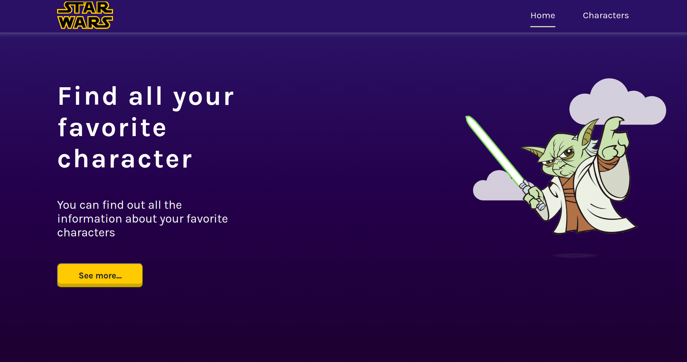
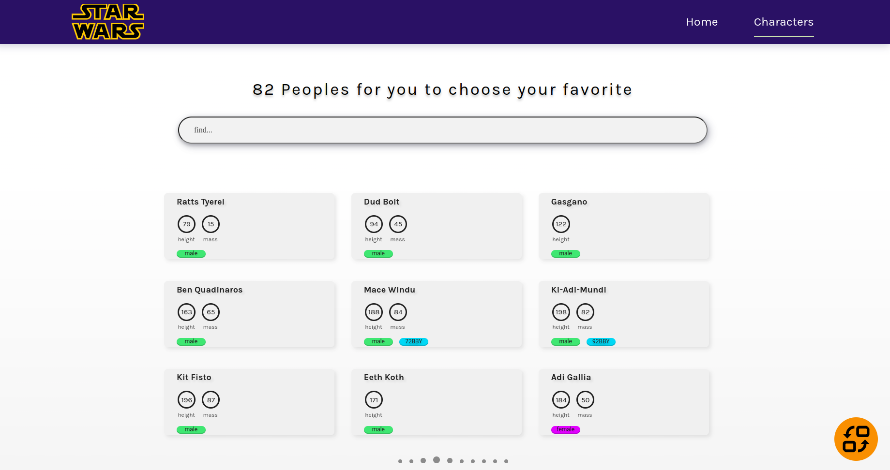
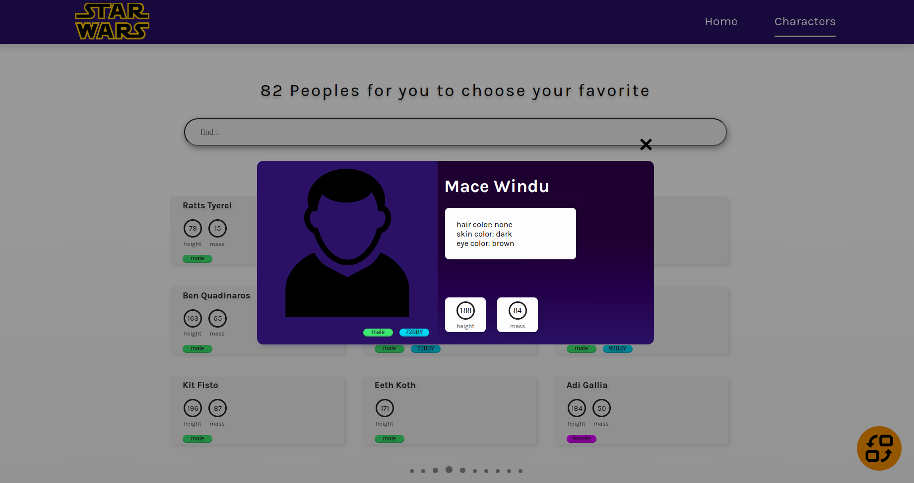
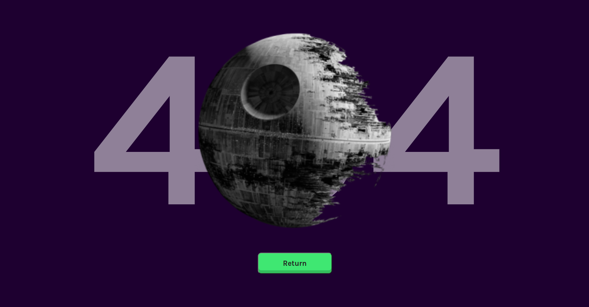

# Star Wars API React App

A React app built using data from the swapi.dev API.

Check out the app [HERE](https://star-wars-seven-pi.vercel.app/)!

## Summary

I built this app to work with external API data.

Some screenshots to show how app displays on mobile devices:

And on laptop. (Also there is one for the tablets, but it's too boring to arrange a readme file).

